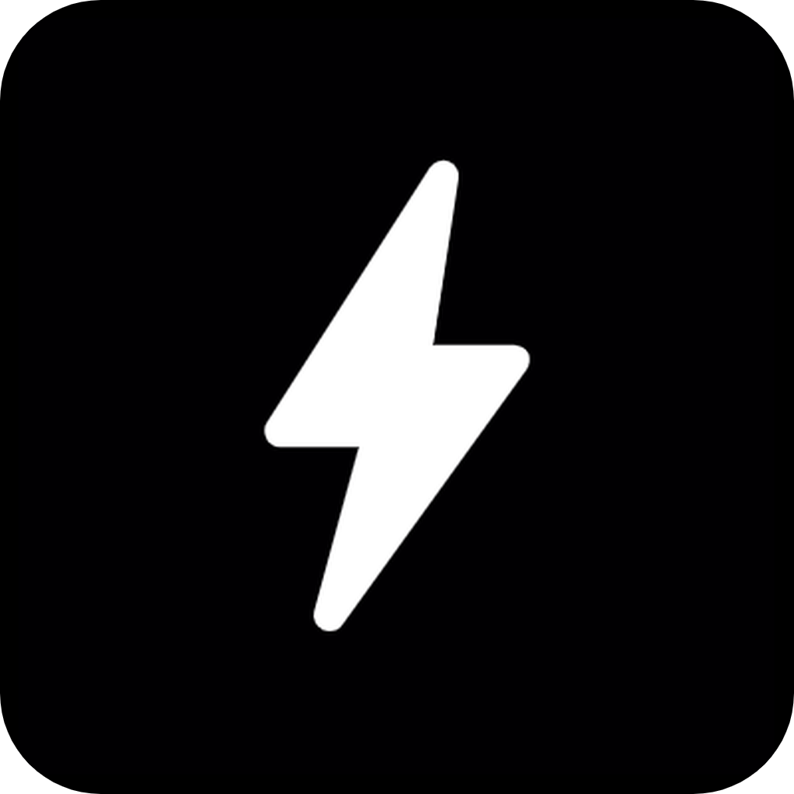

# TeslaPal

## About the app

### TeslaPal

TeslaPal is a vehicle companion app made for Tesla owners. It allows users to see important information and data about their car as well as remotely send commands to it.

### How it works

The app uses the [Tesla API](https://tesla-api.timdorr.com/) through [TeslaSwift](https://github.com/jonasman/TeslaSwift) and a Tesla login to connect to a vehicle. From there, the app can get various information such as location, battery percentage, and more. It can also send commands to the vehicle to unlock the doors, change the temperature, etc.

 

## Concepts used

* SwiftUI
* In-app dark mode switch with UserDefaults
* Working with networking and JSON data
* Data persistence using Core Data

### Features:

- [x] Remote Start
- [x] Track daily miles driven
- [x] Track daily kWh charged
- [x] Add theme customization
- [ ] Trip tracking visualization 
- [ ] Efficieny calculator

 
 

>This is a learning project created by implementing different Swift components. Check my portfolio at [nipun.io](https://nipun.io).

 
